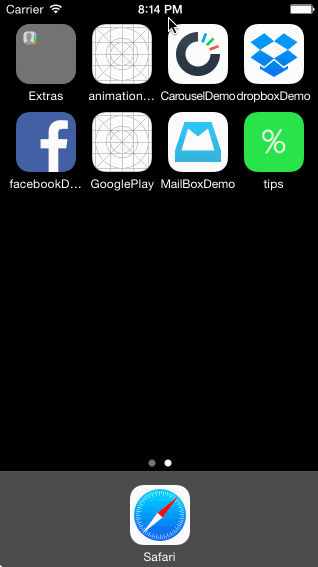

# Dropbox Demo

This is Ryan Sims' Mailbox Demo App that demonstrates usage of animations and gestures.

Time spent: 9-10 hours spent in total

Completed user stories:

Mailbox View
* &#10004; Dragging message left and right to review actions

Hamburger Menu
* &#10004; Panning from the edge should reveal the menu
* &#10004; If the menu is being revealed when the user lifts their finger, it should continue revealing.
* &#10004; If the menu is being hidden when the user lifts their finger, it should continue hiding.

Compose View
* &#10004; Tapping on compose should animate to reveal the compose view.

Segmented Controller
* &#10004; Tapping the segmented control in the title should swipe views in from the left or right..

Walkthrough of all user stories:

GIF created with [LiceCap](http://www.cockos.com/licecap/).

